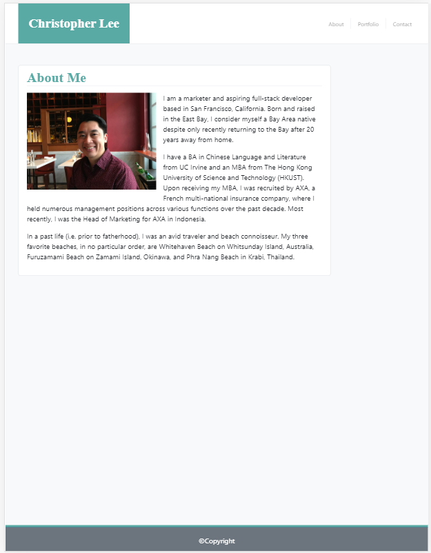
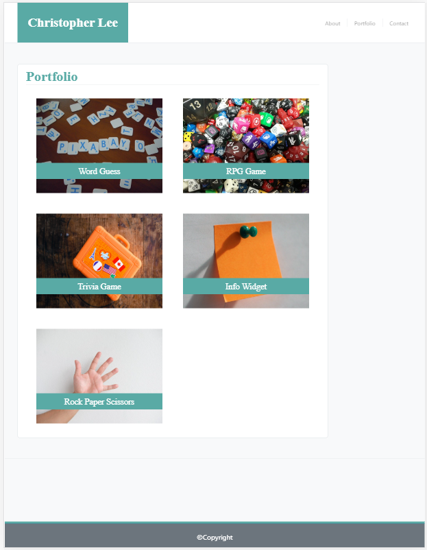
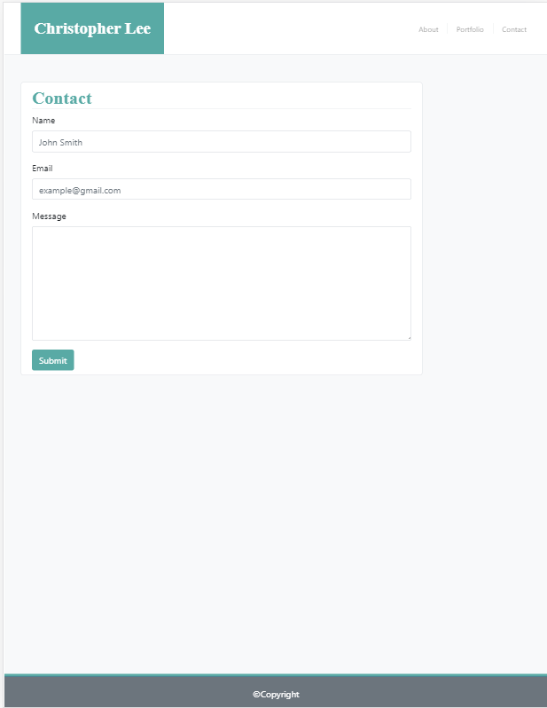

# Responsive Portfolio

## Background
The objective of this exercise was to use (primarily) bootstrap to create a responsive portfolio based on the samples provided incorporating:

   * A navbar

   * A responsive layout

   * Responsive images

Minimum requirements are as follows:

* Functional, deployed application

* GitHub repository with README describing the project

* Navbar must be consistent on each page.

* Navbar on each page must contain links to Home/About, Contact, and Portfolio pages.

* All links must work.

* Must use semantic html.

* Each page must have valid and correct HTML. (use a validation service)

* Must contain your personalized information. (bio, name, images, links to social media, etc.)

* Must properly utilize Bootstrap components and grid system.

## Site Pictures




## Approach

Where possible, to the extent of the author's capabilities, bootstrap was utilized to build this responsive portfolio.  As bootstrap is a framework with embedded aesthetics, custom CSS was utilized at times to match the sample images as much as possible.

## Code Highlight

The below code was used to emulate the nav bar featured in the same images.  Bootstrap display functionality was utilized to achieve the full-bar aesthetic at 640px.
```
<!-- responsive navbar -->
    <nav class="navbar navbar-expand flex-column flex-md-row navbar-dark p-0 border-bottom bg-white bd-navbar overflow-hidden"> 
      <!-- existing brand component with responsive margin and hides on smaller sizes -->
      <a class="navbar-brand p-4 font-weight-bold d-none d-md-block h-100" style="margin-left:3%;font-family: 'Times New Roman', Times, serif;font-size: 30px; background-color:#59AAA5">Christopher Lee</a>
      <!-- appears on smaller sizes with background that fills 100% width -->
      <div class="d-block d-md-none p-4 font-weight-bold m-0" style="width:100%; background-color:#59AAA5">
        <p class="text-center text-white m-0" style="font-family: 'Times New Roman', Times, serif;font-size: 30px;">Christopher Lee</p>
      </div>
      <!-- nav links -->
      <div class="navbar-nav-scroll my-3 ml-md-auto" style="margin-right:3%">
        <ul class="navbar-nav">
          <li class="nav-item">
            <a class="nav-link text-black-50 border-right py-0 px-3" href="index.html"><small>About</small></a>
          </li>
          <li class="nav-item">
            <a class="nav-link text-black-50 border-right py-0 px-3" href="portfolio.html"><small>Portfolio</small></a>
          </li>
          <li class="nav-item">
            <a class="nav-link text-black-50 py-0 pl-3" href="contact.html"><small>Contact</small></a>
        </ul>
      </div>
    </nav>
```

## Built With

* [HTML](https://developer.mozilla.org/en-US/docs/Web/HTML)
* [CSS](https://developer.mozilla.org/en-US/docs/Web/CSS)
* [Bootstrap](https://getbootstrap.com/)

## Deployed Link

* [See Live Site](https://cofchips.github.io/responsive_portfolio/)


## Authors

* **CHRISTOPHER LEE** 

- [Link to Github](https://github.com/CofChips)
- [Link to LinkedIn](https://www.linkedin.com/in/christophernlee/)

## Acknowledgments

* [Bootstrap Sticky Footer example](https://getbootstrap.com/docs/4.0/examples/sticky-footer/)